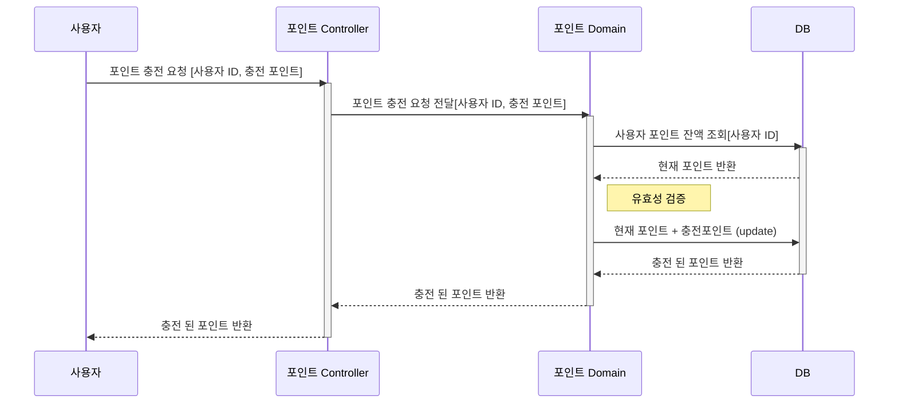
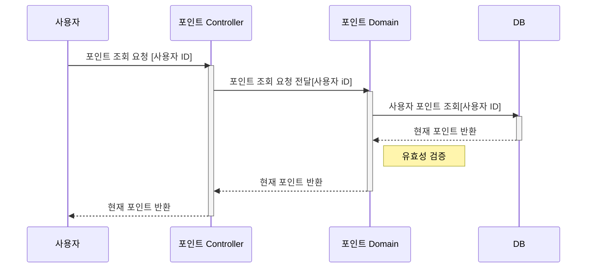
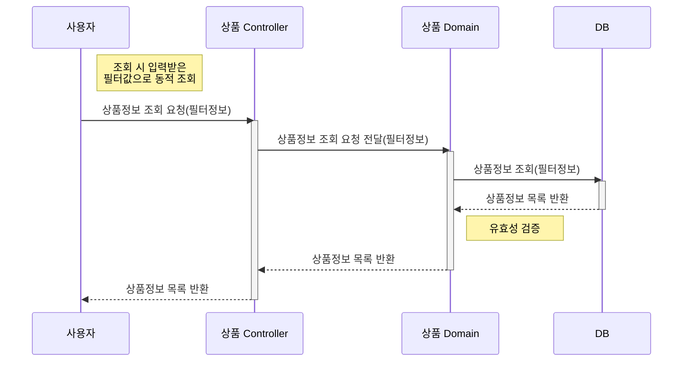
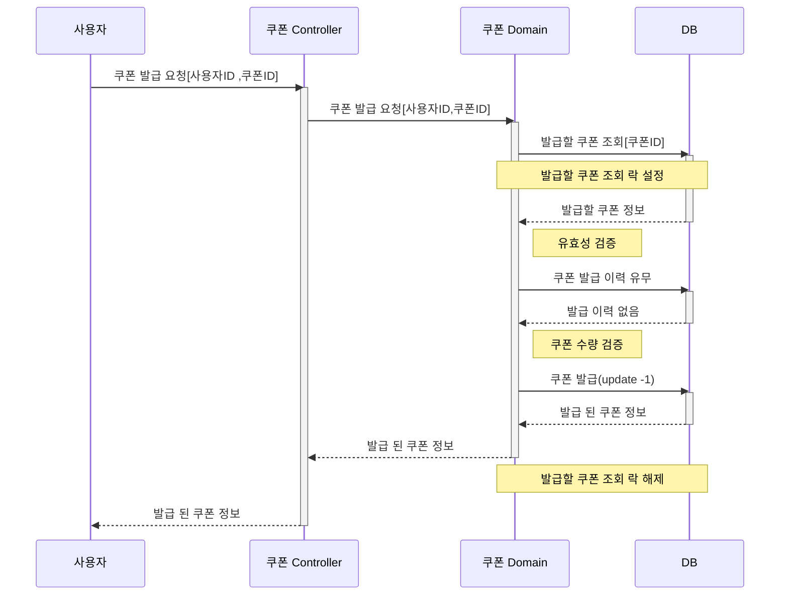
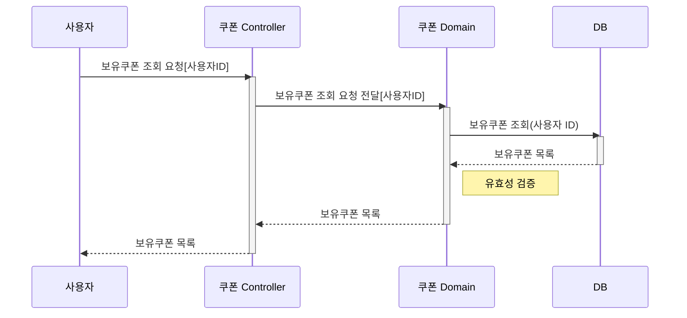
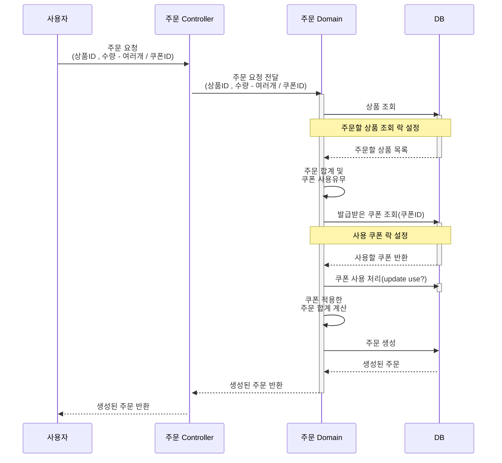
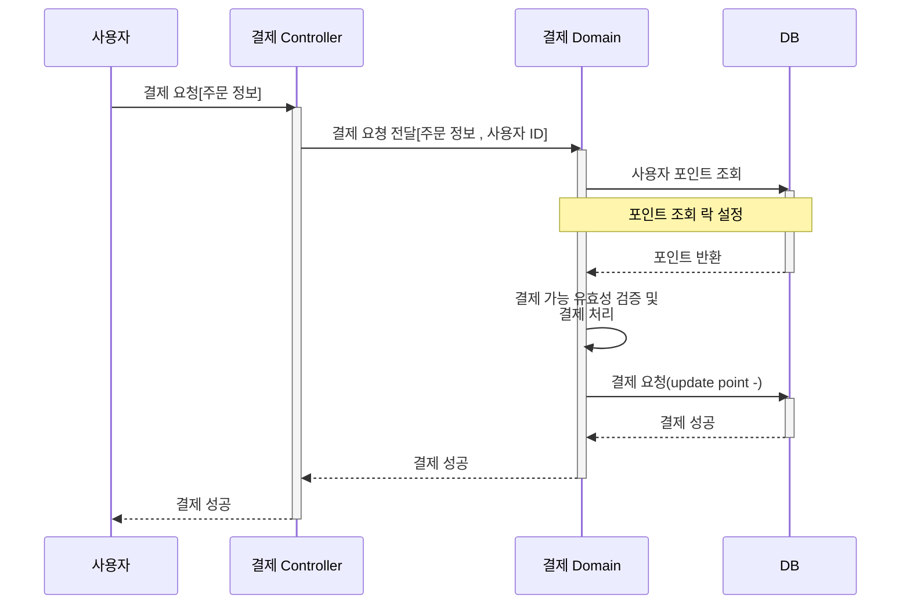

### 학습 기록
- 캐시(전략) 개념 정리 : https://hsdevstudy.tistory.com/43  
- E-Commerce Redis사용 보고서 : https://hsdevstudy.tistory.com/44
- 인덱스 개념 정리 : https://hsdevstudy.tistory.com/45
- 인덱스 적용 후 테스트 성능 보고서 : https://hsdevstudy.tistory.com/46
- MSA 환경에서 트랜잭션 처리 문서: https://hsdevstudy.tistory.com/47

---
### 동시성 제어

<strong> 주요 동시성 문제 개념 이해 (학습용)</strong>

## 1. **Race Condition (경쟁 상태)**

### 개념
- 두 개 이상의 프로세스 또는 스레드가 동일한 자원(예: 변수, 데이터베이스)을 동시에 접근하거나 변경하려고 할 때, **작업 순서에 따라 결과가 달라지는 문제**를 의미합니다.
- 동시성 문제 중 가장 일반적이고 광범위하게 발생할 수 있는 상황.

### 원인
- 공유 자원에 대한 접근이 적절히 동기화되지 않을 때 발생.

### 예제
1. 변수 `counter`의 값이 0인 상태에서 두 개의 스레드가 각각 `counter++` 연산을 실행.
2. `counter++`는 사실상 3단계 연산:
    - `read`: `counter` 값을 읽음.
    - `increment`: 읽은 값에 1을 더함.
    - `write`: 결과를 다시 저장.
3. 스레드 A와 스레드 B가 동시에 실행되면 다음과 같은 문제가 발생:
    - 스레드 A가 값을 읽어 0을 가져오고, 스레드 B도 값을 읽어 0을 가져옴.
    - 각 스레드가 `counter++`를 실행한 결과, 최종 값이 1로 저장됨(실제로는 2가 되어야 함).

### 방지 방법
- 동기화 메커니즘 사용(예: `synchronized`, `Lock`)
- 데이터베이스 트랜잭션 격리 수준 설정

---

## 2. **Deadlock (교착 상태)**

### 개념
- 두 개 이상의 프로세스 또는 스레드가 서로 **상대방이 보유한 자원**을 기다리며, **영원히 진행하지 못하는 상태**를 의미합니다.
- 각 프로세스가 자원을 놓지 않으면 시스템이 멈춥니다.

### 원인
- **상호 배제, 점유 대기, 비선점성, 순환 대기** 조건이 동시에 성립할 때 발생.

### 예제
1. 프로세스 A가 자원 X를 점유하고, 프로세스 B가 자원 Y를 점유.
2. 프로세스 A는 자원 Y를 요청하고, 프로세스 B는 자원 X를 요청.
3. 두 프로세스는 서로 상대방이 점유한 자원을 기다리며 멈춤.

### 방지 방법
- 자원 획득 순서를 고정.
- 타임아웃 설정.
- 교착 상태 탐지 알고리즘 사용.

---

## 3. **Lost Update (갱신 손실)**

### 개념
- **동시에 수행되는 여러 트랜잭션이 동일한 데이터를 갱신하려고 할 때**, 하나의 트랜잭션이 다른 트랜잭션의 결과를 덮어쓰는 문제.
- 최종적으로 저장된 데이터는 일부 트랜잭션의 변경 내용이 사라진 상태.

### 원인
- 적절한 동기화나 트랜잭션 격리 수준이 설정되지 않은 경우 발생.

### 예제
1. 트랜잭션 A와 트랜잭션 B가 동일한 데이터(예: 계좌 잔액 100)를 읽음.
2. 트랜잭션 A는 100에 50을 더해 150으로 갱신.
3. 트랜잭션 B는 100에서 20을 빼 80으로 갱신.
4. 트랜잭션 B가 마지막으로 갱신을 완료하면, 트랜잭션 A의 변경 내용이 사라짐.

### 방지 방법
- 트랜잭션 격리 수준 높이기.
- 데이터베이스의 잠금 메커니즘 활용.

---

## 4. **Dirty Read (더티 리드)**

### 개념
- **한 트랜잭션에서 아직 커밋되지 않은 데이터를 다른 트랜잭션이 읽을 때 발생**하는 문제.
- 이후, 해당 데이터가 롤백되면 이미 읽은 데이터는 유효하지 않게 됩니다.

### 원인
- 낮은 트랜잭션 격리 수준(예: `READ UNCOMMITTED`)에서 발생.

### 예제
1. 트랜잭션 A가 데이터(예: 계좌 잔액 100)를 150으로 업데이트하고, 아직 커밋하지 않음.
2. 트랜잭션 B가 트랜잭션 A의 변경된 데이터를 읽음(잔액 150).
3. 트랜잭션 A가 롤백하면, 데이터는 다시 100으로 복구.
4. 트랜잭션 B는 150이라는 잘못된 데이터를 기준으로 작업.

### 방지 방법
- 트랜잭션 격리 수준 설정(`READ COMMITTED` 이상).

---

## 5. **요약 표**

| **동시성 문제**        | **발생 상황**                                      | **해결 방법**                                |
|------------------------|------------------------------------------------|-------------------------------------------|
| **Race Condition**     | 여러 요청이 동일 데이터를 동시에 읽고 수정할 때.          | 비관적 락, 낙관적 락, 원자적 연산                  |
| **Lost Update**        | 여러 트랜잭션이 동일 데이터를 수정하며 변경이 덮어씌워질 때. | 원자적 연산, 낙관적 락                         |
| **Dirty Read**         | 커밋되지 않은 데이터를 읽고 이를 기반으로 작업할 때.       | 트랜잭션 격리 수준 `READ COMMITTED` 이상       |
| **Non-Repeatable Read** | 동일 데이터를 트랜잭션 내에서 반복 읽을 때 값이 달라질 때. | 트랜잭션 격리 수준 `REPEATABLE READ`          |
| **Deadlock**           | 두 트랜잭션이 서로의 락을 기다리며 멈출 때.             | 락 순서 고정, 타임아웃 설정                     |
| **Phantom Read**       | 동일 조건의 데이터 조회 결과가 트랜잭션 내에서 변할 때.    | 트랜잭션 격리 수준 `SERIALIZABLE`             |

<strong>나의 시나리오에서 발생할 수 있는 동시성 이슈 및 제어 방식 선택</strong>

- 이번 과제를 통해 나의 시나리오 상황을 가정하여 해당 상황에 맞는 동시성 제어 방법을 채택 해 볼 생각입니다. **다만, 여러 가지를 학습하고 적용해보는 것이 학습 방면에서 더 도움이 될 거라고 생각하여 완전히 잘못되거나 틀린 방법이 아니라면 다양한 동시성 제어 방식을 적용해보는 것을 목표로 두고 진행했습니다!**

- 애플리케이션 서버는 분산 서버, DB는 단일 DB로 가정하고 진행했습니다.

---

## **비관적 락, 낙관적 락, Redis 분산 락 비교 표**

| **특징**       | **비관적 락 (Pessimistic Lock)**                       | **낙관적 락 (Optimistic Lock)**               | **Redis 분산 락**                                   |
|----------------|-------------------------------------------------------|-----------------------------------------------|---------------------------------------------------|
| **개념**       | 데이터를 읽을 때 락을 걸어 다른 트랜잭션의 접근을 차단. | 데이터 수정 시 충돌을 감지하여 예외 발생 및 재시도를 통해 충돌 해결. | Redis를 이용해 **분산 환경**에서 동시성 문제를 제어. |
| **동작 방식**  | - `SELECT ... FOR UPDATE`로 데이터에 락 설정.           | - 데이터 수정 시 `@Version` 필드를 확인.       | - Redis 키로 락을 설정하고 TTL(Time-To-Live)로 락 해제 보장. |
|                | - 다른 트랜잭션은 대기 상태로 진입.                   | - 버전 불일치 시 충돌로 처리.                  |                                                   |
| **장점**       | - 데이터 충돌 가능성이 높은 환경에서 안전.              | - 충돌이 드문 환경에서 성능 우수.              | - 여러 서버나 애플리케이션 간 **글로벌 락** 제공.    |
|                | - 데이터 무결성을 강력히 보장.                        | - 데이터베이스 락이 없어 대기 없음.             | - 빠르고 간단한 구현 가능.                         |
| **단점**       | - 락 대기로 인해 성능 저하.                           | - 충돌 발생 시 예외 및 재시도 로직 필요.        | - Redis 장애 시 락 관리 문제.                      |
|                | - 데드락 발생 가능.                                   | - 충돌이 많으면 성능 저하.                     | - TTL 설정 및 락 소유권 관리 필요.                 |

---

## **1. 상품 재고 차감 및 복원**

### 주요 동시성 문제

| **상황**                                  | **문제**                                                                                 |
|------------------------------------------|-----------------------------------------------------------------------------------------|
| **동시에 여러 사용자가 같은 상품을 구매** | 여러 요청이 동시에 재고를 읽고 수정하려고 하면서, 재고가 초과 차감되거나 잘못된 수량으로 저장되는 문제 발생.       |
| **재고 부족 상태에서 동시에 구매 요청**    | 재고가 부족한 상태임에도 불구하고 중복 요청이 처리되면서 잔여 재고가 음수로 기록되거나 시스템 오류가 발생.         |
| **재고 수정 중 네트워크 지연 및 재시도**   | 네트워크 지연으로 인해 사용자가 동일 요청을 반복해서 보낼 경우, 재고 데이터가 중복 차감되거나 복원이 중복으로 이루어짐. |

### 동시성 제어 방법 선택 및 도출 과정

- **비관적 락 선택**
   - 상품 재고 차감 및 복원 로직은 여러 사용자가 동일한 상품을 구매할 경우 재고 수가 변경되는 형태입니다. 따라서 동일한 상품에 대한 동시 주문 요청으로 인해 재고 데이터의 정합성이 깨지는 것을 방지하기 위해 동시성 제어가 필요하다고 판단했습니다.
   - 단순히 동시에 상품을 구매했다는 이유로 다른 사용자의 구매 요청이 실패한다면, 사용자 입장에서 큰 불편함을 초래할 수 있다고 생각하여 **낙관적 락**은 제외했습니다.
   - 자연스럽게 **비관적 락**과 **분산 락** 중에서 선택을 고민하게 되었고, 두 방법의 가장 큰 차이를 **DB 성능 부하의 강도**라고 보았습니다.
   - 동일 상품에 대한 동시 주문 요청이 대규모로 발생할 가능성은 **이벤트성 선착순 쿠폰 발급 로직보다 적을 것**이라고 가정하였기에, 분산 락은 선착순 쿠폰 발급에서 사용해볼 수 있으니, 순차적으로 동시성 제어를 보장해주는 **비관적 락**을 선택하게 되었습니다.

---

## **2. 포인트 잔액 차감 및 충전**

### 주요 동시성 문제

| **상황**                        | **문제**                                                                           |
|--------------------------------|-----------------------------------------------------------------------------------|
| **연속 클릭으로 인한 중복 요청** | 동일 요청이 여러 번 처리되면서 포인트 중복 차감 및 충전 중복 발생.                             |
| **여러 기기에서 동시에 요청**    | 동일한 포인트 데이터에 대해 중복 충전 및 차감이 발생.                                         |
| **네트워크 지연 및 재시도**      | 첫 요청 처리 완료 후 응답이 늦어 중복 요청 발생.                                              |
| **잔액 부족 상황에서의 동시 요청** | 잔액 부족임에도 중복 요청 처리로 인해 잔액 음수 또는 오류 발생.                                 |

### 동시성 제어 방법 선택 및 도출 과정

- **낙관적 락 선택**
   - 포인트 잔액 차감 및 충전 기능은 **동일한 사용자가 자신의 포인트에만 접근할 수 있도록 설계된 비즈니스 로직**이 적용되어 있어, 정상적인 사용자 요청에 의한 동시성 이슈는 비교적 적게 발생할 것으로 판단했습니다.
   - 다만, **부당한 목적의 요청** 또는 **의도치 않은 중복 요청**(예: 연속 클릭, 네트워크 지연으로 인한 재시도 요청 등)이 발생할 가능성은 존재한다고 생각했습니다.
   - 금전적인 거래가 포함된 비즈니스 로직의 특성을 고려할 때, 사용자 편의를 위해 모든 동시 요청을 성공 처리하기보다는 **데이터의 무결성을 최우선 순위로 고려**해야 한다고 판단했습니다.
   - 이에 따라, 동시성 문제로 포인트 데이터가 손상되지 않도록 **낙관적 락(Optimistic Lock)**을 활용하여 단일 요청만 성공 처리하고, 나머지 요청은 실패 응답으로 처리하도록 설계했습니다.

---

## **3. 선착순 쿠폰 발급**

### 목표
- 쿠폰 수량이 제한된 이벤트에서 다수의 사용자가 동시에 쿠폰을 요청할 때, **정확한 수량만 발급**되도록 동시성 제어를 구현해보자!

### 주요 동시성 문제

| **상황**                         | **문제**                                                                 |
|----------------------------------|-------------------------------------------------------------------------|
| **동시에 여러 사용자가 쿠폰을 요청** | 여러 사용자가 동시에 쿠폰 발급 요청을 보내면, **설정된 수량보다 초과 발급**될 가능성이 있음.    |
| **같은 사용자가 여러 번 요청**     | 동일 사용자가 **중복 요청**을 통해 여러 개의 쿠폰을 받을 가능성이 있음.                   |
| **트랜잭션 중 데이터 조회**       | 트랜잭션 중 수량 정보가 **일관되지 않게 조회**될 가능성이 있음.                          |
| **처리 순서 보장 실패**           | 요청 처리 순서가 보장되지 않아, **늦게 요청한 사용자가 먼저 쿠폰을 받는 상황**이 발생할 수 있음. |
| **폭발적인 요청으로 인한 부하**     | 서버나 DB가 **폭발적인 트래픽**을 처리하지 못해 성능 저하 및 장애가 발생할 가능성이 있음.      |

### 동시성 제어 방법 선택 및 도출 과정

- **Redis 분산 락 선택**
   - 선착순 쿠폰 발급은 이벤트성 트래픽이 순간적으로 폭발하여 **정확한 수량 발급 보장**이 중요합니다.
   - 트래픽이 몰리면 DB 부하가 급격히 증가하고 요청 처리 속도가 느려질 가능성이 큽니다.
   - 위와 같은 이유로 **비관적 락**과 **낙관적 락**은 폭발적인 요청 처리 성능에서는 한계가 있다고 판단하여 **Redis 분산 락**을 선택하였습니다.
      - **메모리 기반**으로 DB 부하를 줄이고 요청 처리 속도를 향상.
      - 분산 환경에서도 데이터 정합성과 동시성 제어를 보장.
      - **TTL 설정**으로 교착 상태 방지 가능.

---

### API Swagger 
https://app.swaggerhub.com/apis-docs/HANSEOK8541/E-commerce/1.0.0

---

### 포인트 충전

---

### 포인트 조회

---
### 상품 조회

---

### 선착순 쿠폰 발급

---

### 보유 쿠폰 목록 조회

---

### 주문

---

### 결제

