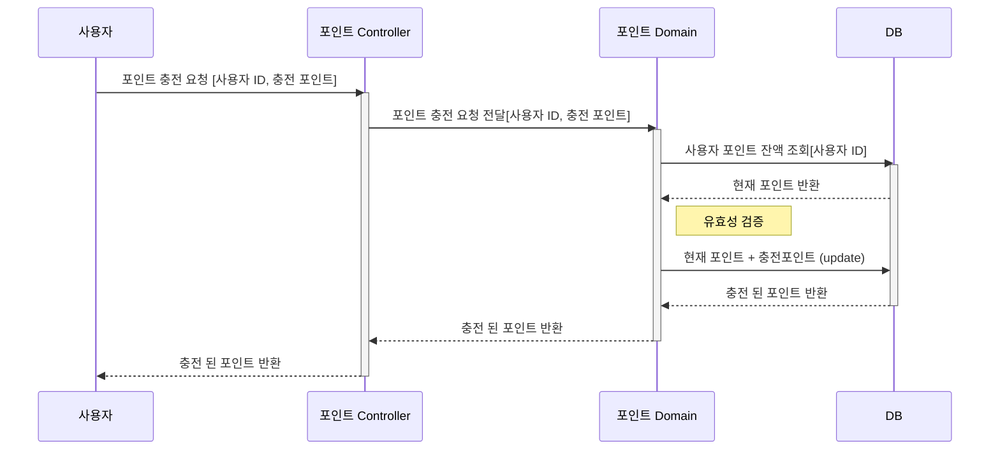

# 시퀀스 다이어그램

### 포인트 충전

```mermaid
%% 포인트 충전
sequenceDiagram
    participant 사용자
    participant 포인트 Controller
    participant 포인트 Domain
    participant DB
    
    사용자->>포인트 Controller: 포인트 충전 요청 [사용자 ID, 충전 포인트]
    activate 포인트 Controller
    포인트 Controller->>포인트 Domain: 포인트 충전 요청 전달[사용자 ID, 충전 포인트]
    activate 포인트 Domain
    포인트 Domain->>DB: 사용자 포인트 잔액 조회[사용자 ID]
    activate DB
    DB-->>포인트 Domain: 현재 포인트 반환
    note right of 포인트 Domain: 유효성 검증
    포인트 Domain->>DB: 현재 포인트 + 충전포인트 (update)
    DB-->>포인트 Domain: 충전 된 포인트 반환
    deactivate DB
    포인트 Domain-->>포인트 Controller: 충전 된 포인트 반환
    deactivate 포인트 Domain
    포인트 Controller-->>사용자: 충전 된 포인트 반환
    deactivate 포인트 Controller
```
---
