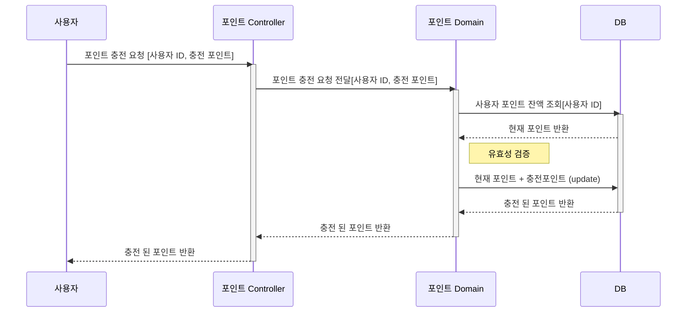
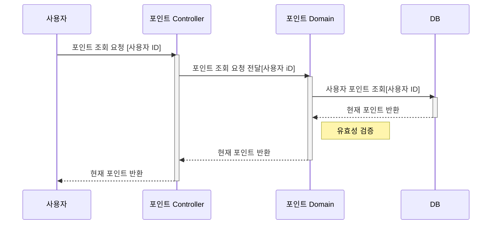
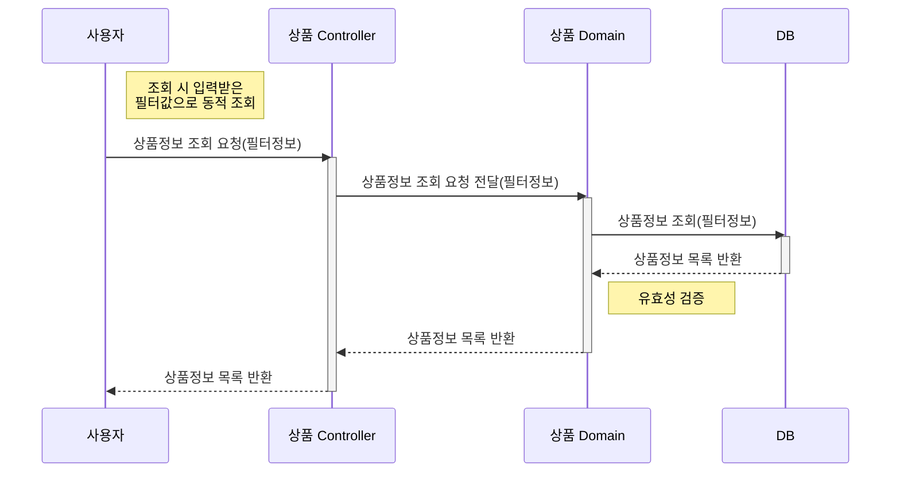
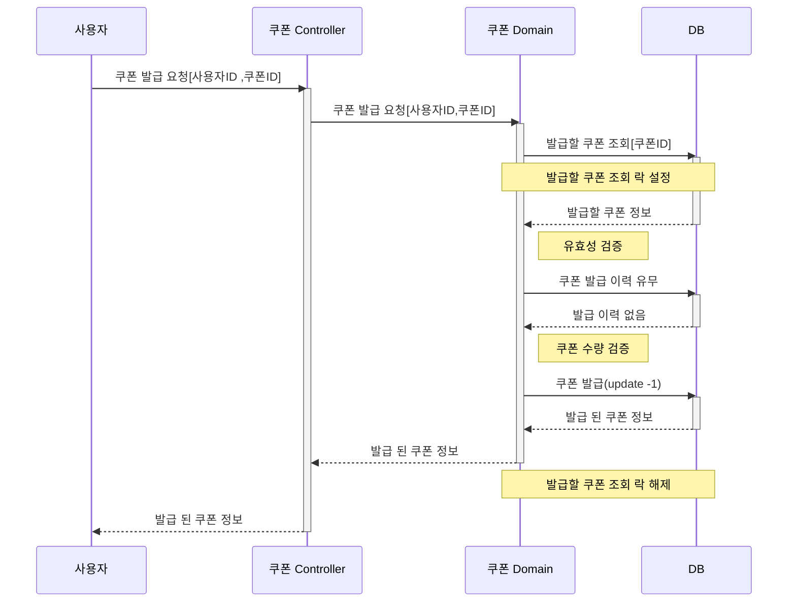
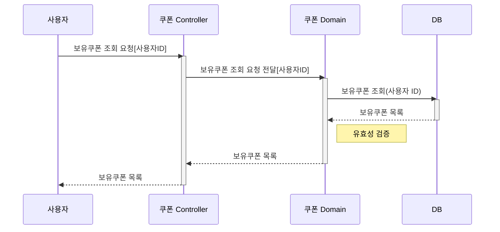
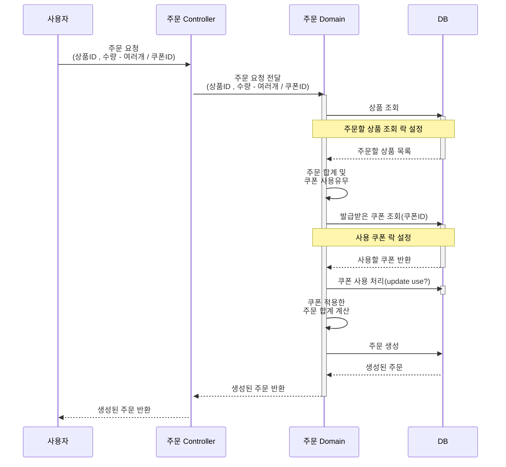
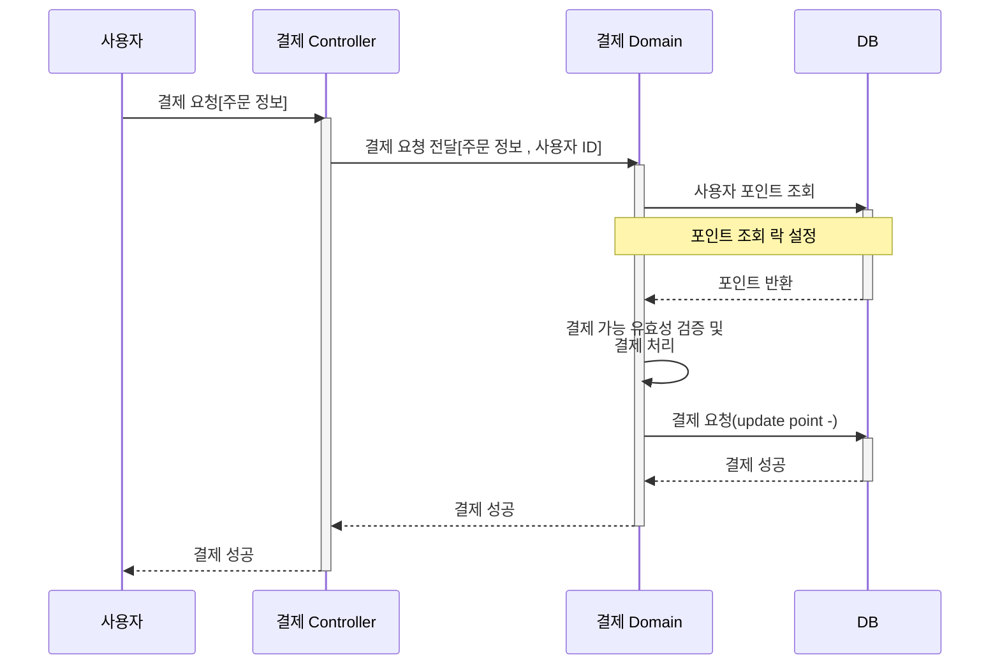

# 시퀀스 다이어그램

### 포인트 충전

```mermaid
%% 포인트 충전
sequenceDiagram
    participant 사용자
    participant 포인트 Controller
    participant 포인트 Domain
    participant DB
    
    사용자->>포인트 Controller: 포인트 충전 요청 [사용자 ID, 충전 포인트]
    activate 포인트 Controller
    포인트 Controller->>포인트 Domain: 포인트 충전 요청 전달[사용자 ID, 충전 포인트]
    activate 포인트 Domain
    포인트 Domain->>DB: 사용자 포인트 잔액 조회[사용자 ID]
    activate DB
    DB-->>포인트 Domain: 현재 포인트 반환
    note right of 포인트 Domain: 유효성 검증
    포인트 Domain->>DB: 현재 포인트 + 충전포인트 (update)
    DB-->>포인트 Domain: 충전 된 포인트 반환
    deactivate DB
    포인트 Domain-->>포인트 Controller: 충전 된 포인트 반환
    deactivate 포인트 Domain
    포인트 Controller-->>사용자: 충전 된 포인트 반환
    deactivate 포인트 Controller
```
---

### 포인트 조회

```mermaid
%%포인트 조회
sequenceDiagram
			participant 사용자
			participant 포인트 Controller
			participant 포인트 Domain
			participant DB
			
			사용자->>포인트 Controller: 포인트 조회 요청 [사용자 ID]
			activate 포인트 Controller
			포인트 Controller->>포인트 Domain: 포인트 조회 요청 전달[사용자 iD]
			activate 포인트 Domain
			포인트 Domain->>DB : 사용자 포인트 조회[사용자 ID]
			activate DB
			DB-->>포인트 Domain: 현재 포인트 반환
			deactivate DB
			note right of 포인트 Domain: 유효성 검증
			포인트 Domain-->> 포인트 Controller : 현재 포인트 반환
			deactivate 포인트 Domain
			포인트 Controller-->> 사용자 : 현재 포인트 반환
			deactivate 포인트 Controller
```
---
### 상품 조회

```mermaid
sequenceDiagram
			participant 사용자
			participant 상품 Controller
			participant 상품 Domain
			participant DB
			
			note right of 사용자 : 조회 시 입력받은 <br>필터값으로 동적 조회
			사용자->>상품 Controller : 상품정보 조회 요청(필터정보)
			activate 상품 Controller
			상품 Controller->>상품 Domain: 상품정보 조회 요청 전달(필터정보)
			activate 상품 Domain
			상품 Domain->>DB : 상품정보 조회(필터정보)
			activate DB
			DB-->>상품 Domain: 상품정보 목록 반환
			deactivate DB
			note right of 상품 Domain: 유효성 검증
			상품 Domain-->>상품 Controller : 상품정보 목록 반환
			deactivate 상품 Domain
			상품 Controller-->>사용자 : 상품정보 목록 반환
			deactivate 상품 Controller
```
---

### 선착순 쿠폰 발급

```mermaid
sequenceDiagram
			participant 사용자
			participant 쿠폰 Controller
			participant 쿠폰 Domain
			participant DB
			
			사용자->>쿠폰 Controller : 쿠폰 발급 요청[사용자ID ,쿠폰ID]
			activate 쿠폰 Controller
			쿠폰 Controller->>쿠폰 Domain: 쿠폰 발급 요청[사용자ID,쿠폰ID]
			activate 쿠폰 Domain
			쿠폰 Domain->>DB : 발급할 쿠폰 조회[쿠폰ID]
			activate DB
			Note over 쿠폰 Domain,DB : 발급할 쿠폰 조회 락 설정
			DB-->> 쿠폰 Domain : 발급할 쿠폰 정보 
			deactivate DB
		  note right of 쿠폰 Domain: 유효성 검증
			
			쿠폰 Domain->>DB : 쿠폰 발급 이력 유무
			activate DB
			DB-->>쿠폰 Domain : 발급 이력 없음
  		deactivate DB
  		note right of 쿠폰 Domain: 쿠폰 수량 검증
  		쿠폰 Domain->>DB : 쿠폰 발급(update -1)
  		activate DB
  		DB-->>쿠폰 Domain : 발급 된 쿠폰 정보
  		deactivate DB
			쿠폰 Domain-->>쿠폰 Controller : 발급 된 쿠폰 정보
			deactivate 쿠폰 Domain
			Note over 쿠폰 Domain,DB : 발급할 쿠폰 조회 락 해제
			쿠폰 Controller-->>사용자 : 발급 된 쿠폰 정보
			deactivate 쿠폰 Controller
```
---

### 보유 쿠폰 목록 조회

```mermaid
sequenceDiagram
			participant 사용자
			participant 쿠폰 Controller
			participant 쿠폰 Domain
			participant DB
			
			사용자->>쿠폰 Controller : 보유쿠폰 조회 요청[사용자ID]
			activate 쿠폰 Controller
			쿠폰 Controller->>쿠폰 Domain: 보유쿠폰 조회 요청 전달[사용자ID]
			activate 쿠폰 Domain
			쿠폰 Domain->>DB : 보유쿠폰 조회(사용자 ID)
			activate DB
			DB-->> 쿠폰 Domain : 보유쿠폰 목록
			deactivate DB
			note right of 쿠폰 Domain: 유효성 검증
			쿠폰 Domain -->> 쿠폰 Controller : 보유쿠폰 목록
			deactivate 쿠폰 Domain
			쿠폰 Controller-->> 사용자 : 보유쿠폰 목록
			deactivate 쿠폰 Controller
```
---

### 주문

```mermaid
sequenceDiagram
			participant 사용자
			participant 주문 Controller
			participant 주문 Domain
			participant DB
			
			사용자->>주문 Controller : 주문 요청<br>(상품ID , 수량 - 여러개 / 쿠폰ID)
			activate 주문 Controller
			주문 Controller->>주문 Domain : 주문 요청 전달<br>(상품ID , 수량 - 여러개 / 쿠폰ID)
			activate 주문 Domain
			주문 Domain ->> DB : 상품 조회
			activate DB
			Note over 주문 Domain,DB : 주문할 상품 조회 락 설정
			DB-->>주문 Domain : 주문할 상품 목록
			deactivate DB
		  주문 Domain->> 주문 Domain : 주문 합계 및 <br>쿠폰 사용유무
		  주문 Domain->> DB : 발급받은 쿠폰 조회(쿠폰ID)
		  activate DB
		  Note over 주문 Domain,DB : 사용 쿠폰 락 설정 
      DB-->> 주문 Domain : 사용할 쿠폰 반환 
			deactivate DB
			주문 Domain->> DB : 쿠폰 사용 처리(update use?)
			activate DB
			deactivate DB
			주문 Domain->> 주문 Domain : 쿠폰 적용한 <br>주문 합계 계산
			주문 Domain->> DB : 주문 생성
			activate DB
			DB-->> 주문 Domain : 생성된 주문
			주문 Domain-->> 주문 Controller : 생성된 주문 반환
			deactivate 주문 Domain 
			주문 Controller-->> 사용자 : 생성된 주문 반환
```
---

### 결제

```mermaid
sequenceDiagram
			participant 사용자
			participant 결제 Controller
			participant 결제 Domain
			participant DB
			
			사용자->> 결제 Controller : 결제 요청[주문 정보]
			activate 결제 Controller
			결제 Controller->> 결제 Domain : 결제 요쳥 전달[주문 정보 , 사용자 ID]
			activate 결제 Domain
			결제 Domain ->> DB : 사용자 포인트 조회 
			activate DB
			Note over 결제 Domain,DB : 포인트 조회 락 설정
			DB -->> 결제 Domain : 포인트 반환
			deactivate DB
			결제 Domain ->> 결제 Domain : 결제 가능 유효성 검증 및 <br>결제 처리
			결제 Domain ->> DB : 결제 요청(update point -)
			activate DB
			DB -->> 결제 Domain : 결제 성공
			deactivate DB
			결제 Domain -->> 결제 Controller : 결제 성공
			deactivate 결제 Domain
			결제 Controller -->> 사용자 : 결제 성공
			deactivate 결제 Controller
```
